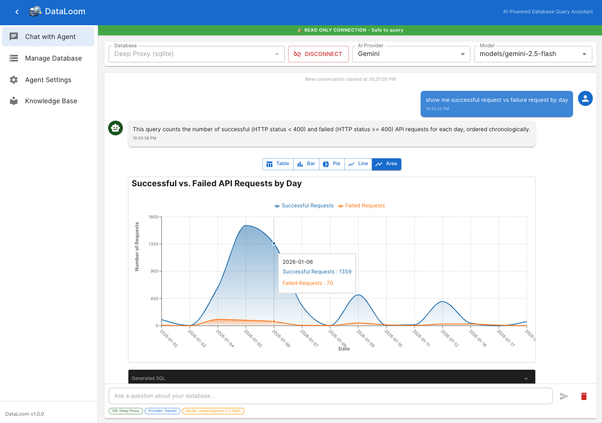
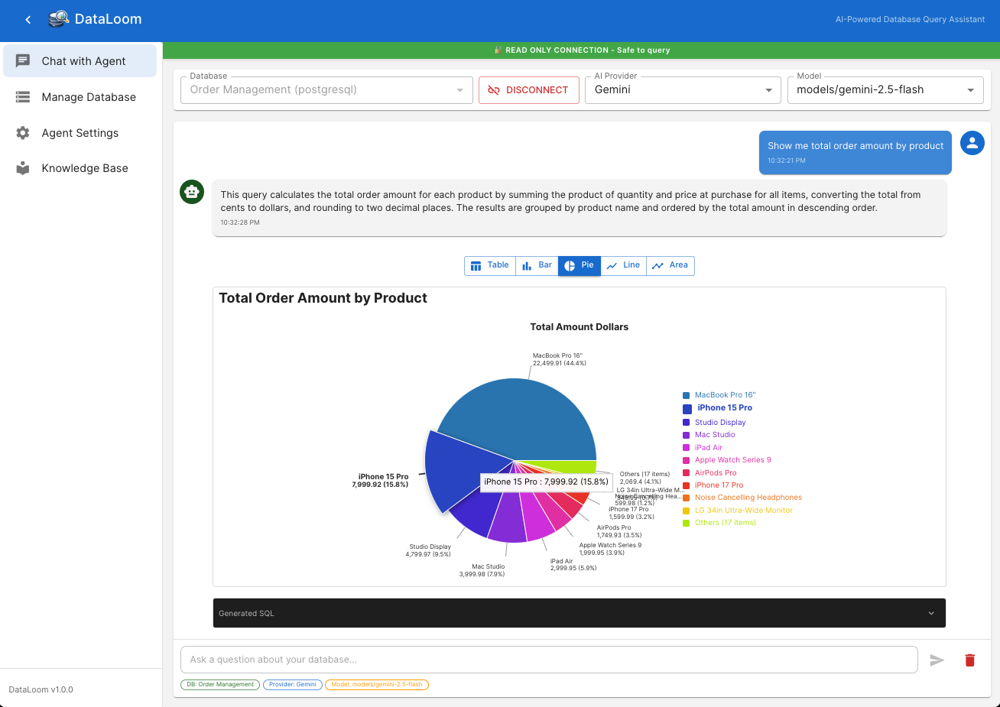
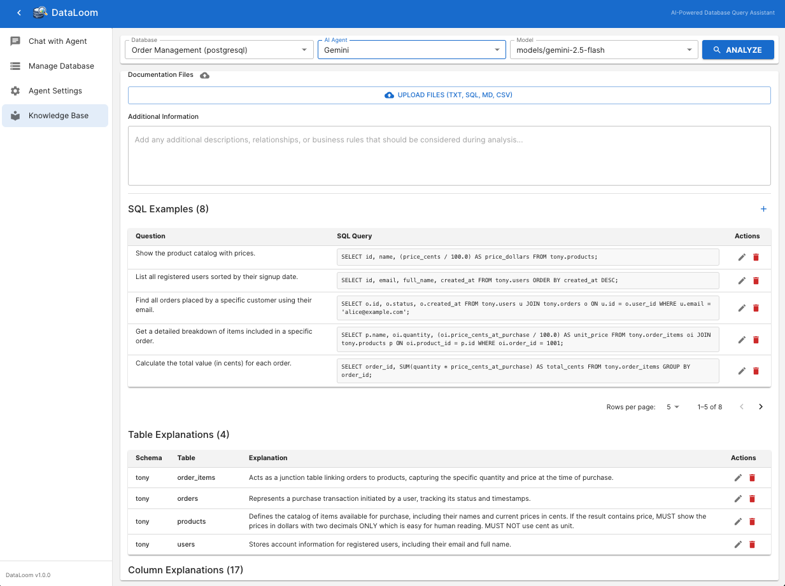
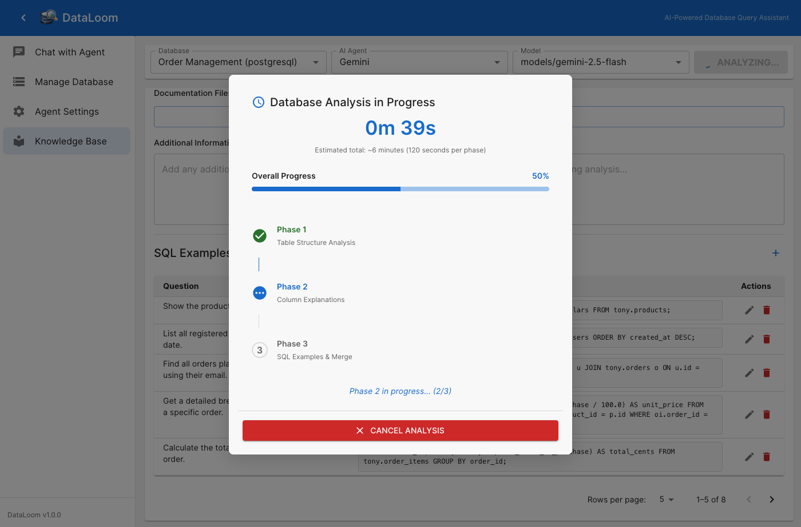
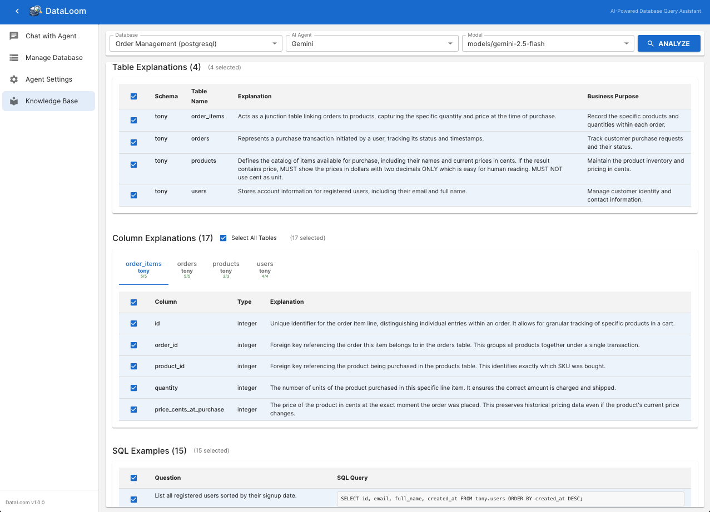
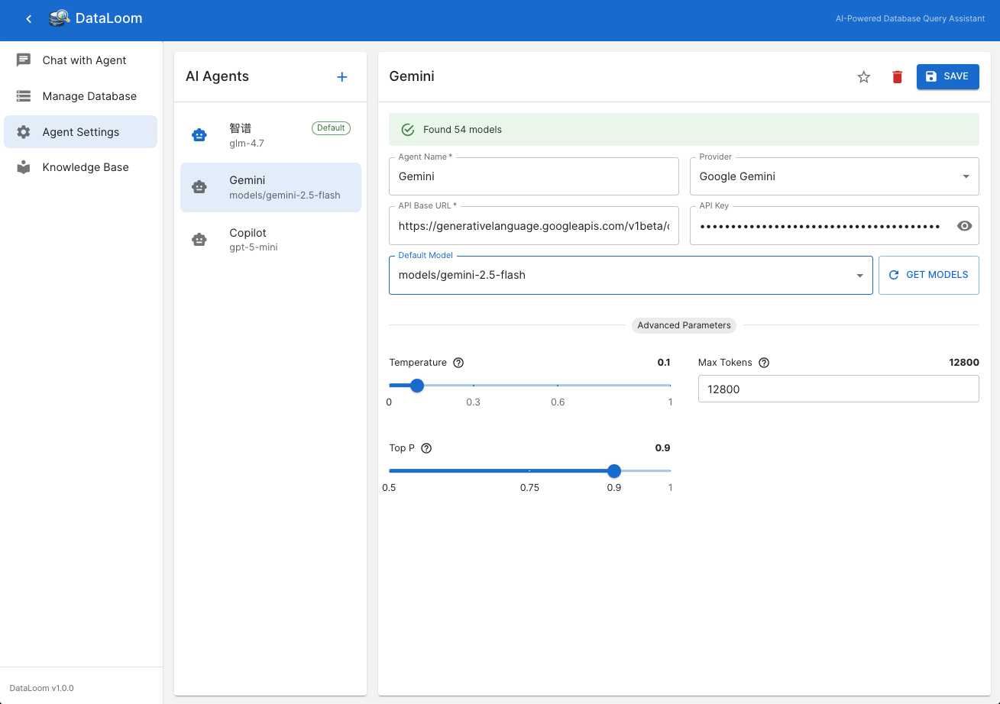
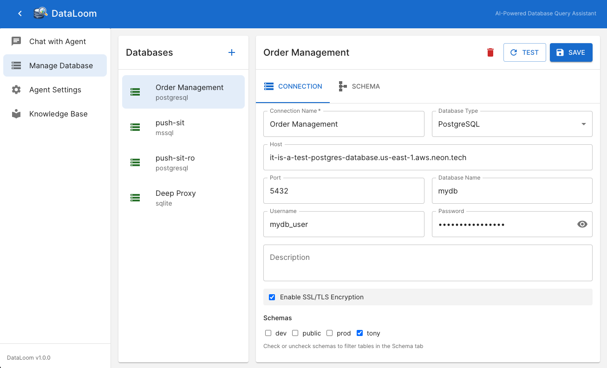

# DataLoom

AI-powered database query assistant with a natural language interface. Query your databases using plain English, visualize results automatically, and explore data safely with read-only protection.

## Features

### Core Capabilities

- **Natural Language Queries** - Ask questions in plain English, get instant SQL results
- **Multi-AI Provider Support** - Connect to multiple AI providers:
  - GitHub Copilot (local)
  - OpenAI (GPT-4, GPT-3.5, etc.)
  - Anthropic (Claude)
  - Google Gemini
  - Zhipu AI (智谱)
  - Azure OpenAI
  - Ollama (local models)
  - Custom OpenAI-compatible APIs
- **Multi-Database Support** - Works with:
  - SQLite
  - PostgreSQL
  - SQL Server (MSSQL)
- **Smart Visualization** - Automatic chart recommendations based on query patterns
  - Line charts for time series
  - Bar charts for comparisons
  - Pie charts for distributions
  - Area charts for cumulative data
  - Tables for detailed data
- **Knowledge Base System** - Store and manage:
  - Table explanations and business context
  - Column descriptions and data formatting rules
  - SQL examples for common queries
  - Custom metadata to guide AI query generation
- **AI-Powered Database Analysis** - Automatic 3-phase analysis:
  - Phase 1: Table structure and relationships
  - Phase 2: Data patterns and insights
  - Phase 3: Business logic and recommendations
- **Read-Only Protection** - Multiple security layers ensure your data stays safe:
  - SQL keyword blocking (INSERT, UPDATE, DELETE, etc.)
  - Injection detection (comments, statement chaining, UNION attacks)
  - Database-level protection (read-only mode/transactions)
  - Performance guards (JOIN limits, query timeout, result row limits)
- **Chat Session Management** - Persistent chat sessions with context awareness
- **Connection Management** - Safe database connection handling with idle timeout
- **Agent Configuration** - Flexible AI agent settings with model selection

## Screenshots

### 1. Natural Language Chat Interface



The intuitive chat interface allows you to query your database using nature language. Simply type your question and get instant SQL results with automatic visualization.

### 2. Query Results with Visualization



Query results are automatically visualized with appropriate chart types. The system intelligently selects the best visualization format based on your data - whether it's time series, comparisons, distributions, or detailed tables.

### 3. Knowledge Base Management



Manage your database knowledge base with detailed table explanations, column descriptions, and SQL examples. Add business context and formatting rules to guide the AI in generating more accurate queries.

### 4. Database Analysis



Initiate an AI-powered 3-phase database analysis to automatically discover table structures, relationships, data patterns, and business logic. This helps build a comprehensive knowledge base for your database.

### 5. Analysis Results



Review the detailed analysis results generated by AI. The system provides insights into table structures, column relationships, data patterns, and suggests business logic that can be refined in the knowledge base.

### 6. AI Agent Settings



Configure multiple AI agents with different providers, models, and parameters. Support for OpenAI, Anthropic, Google Gemini, Zhipu AI, Azure OpenAI, Ollama, and custom providers. Set temperature, max tokens, and other parameters for optimal performance.

### 7. Database Connection Management



Manage multiple database connections with support for SQLite, PostgreSQL, and SQL Server. Configure connection strings, test connections, and enable read-only protection for safe data exploration.

## Tech Stack

### Backend
- **Runtime**: Node.js 18+ with TypeScript
- **Framework**: Express.js
- **Database**: SQLite (internal), better-sqlite3
- **Database Drivers**: pg (PostgreSQL), mssql (SQL Server), better-sqlite3 (SQLite)
- **AI Integration**: Custom providers for multiple AI services
- **Logging**: Winston with file rotation
- **Testing**: Jest with coverage
- **Security**: Helmet, CORS, SQL injection protection

### Frontend
- **Framework**: React 18 with TypeScript
- **Build Tool**: Vite for fast development
- **UI Library**: Material-UI (MUI) components
- **State Management**: Zustand
- **Charts**: Recharts for data visualization
- **Routing**: React Router DOM

## Getting Started

### Prerequisites

- Node.js 18+ 
- npm 9+
- For GitHub Copilot: GitHub Copilot extension running locally (port 1287)
- For AI providers: API keys as needed

### Installation

```bash
# Clone the repository
git clone https://github.com/fihtony/DataLoom.git
cd DataLoom

# Install all dependencies (root, backend, and frontend)
npm run install:all

# Initialize the database
cd backend
npm run db:init
```

### Configuration

1. **Backend Environment** (optional - create `backend/.env`):
   ```env
   PORT=8060
   FRONTEND_URL=http://localhost:3060
   DATALOOM_DB_PATH=./data/dataloom.db
   LOG_LEVEL=info
   ```

2. **AI Agent Setup**:
   - Open the application in your browser
   - Navigate to "Agent Settings"
   - Add and configure your AI agents (API keys, models, etc.)
   - Set a default agent for queries

### Development

```bash
# Start backend server (runs on port 8060)
npm run dev:backend

# In another terminal, start frontend dev server (runs on port 3060)
npm run dev:frontend
```

Open http://localhost:3060 in your browser.

### Production Build

```bash
# Build both backend and frontend
npm run build

# Start production server
npm start
```

## Project Structure

```
DataLoom/
├── backend/                    # Express + TypeScript backend
│   ├── src/
│   │   ├── commands/          # CLI commands (db-init)
│   │   ├── routes/            # API endpoints
│   │   │   ├── query.ts       # Natural language query endpoint
│   │   │   ├── copilot.ts     # GitHub Copilot integration
│   │   │   └── dataloom.ts    # Database & knowledge base management
│   │   ├── services/          # Business logic
│   │   │   ├── agent/         # AI agent providers
│   │   │   │   ├── providers/ # Provider implementations
│   │   │   │   └── types.ts   # Agent types
│   │   │   ├── database/      # SQL validation & connection management
│   │   │   ├── copilot/       # GitHub Copilot client
│   │   │   └── dataloom/      # Knowledge base & database service
│   │   ├── prompts/           # AI prompt templates
│   │   │   ├── sql-query-generation.prompt.ts
│   │   │   ├── database-schema-analysis.prompt.ts
│   │   │   └── database-phased-analysis.prompt.ts
│   │   ├── types/             # TypeScript definitions
│   │   └── utils/             # Utilities (logger, etc.)
│   ├── data/                  # SQLite database files
│   ├── logs/                  # Application logs
│   └── package.json
├── frontend/                  # React + Vite frontend
│   ├── src/
│   │   ├── components/        # UI components
│   │   │   ├── charts/        # Chart components (Line, Bar, Pie, etc.)
│   │   │   └── pages/          # Main application pages
│   │   │       ├── ChatPage.tsx
│   │   │       ├── DatabasePage.tsx
│   │   │       ├── AgentSettingsPage.tsx
│   │   │       ├── KnowledgeBasePage.tsx
│   │   │       └── DevelopmentPage.tsx
│   │   ├── services/          # API client & utilities
│   │   ├── store/             # Zustand state management
│   │   └── types/             # TypeScript definitions
│   └── package.json
├── package.json               # Root workspace configuration
└── README.md
```

## License

MIT License - see [LICENSE](LICENSE) for details

## Author & Owner

**Tony Xu** <fihtony@gmail.com>

Copyright © 2026 Tony Xu. All rights reserved.
